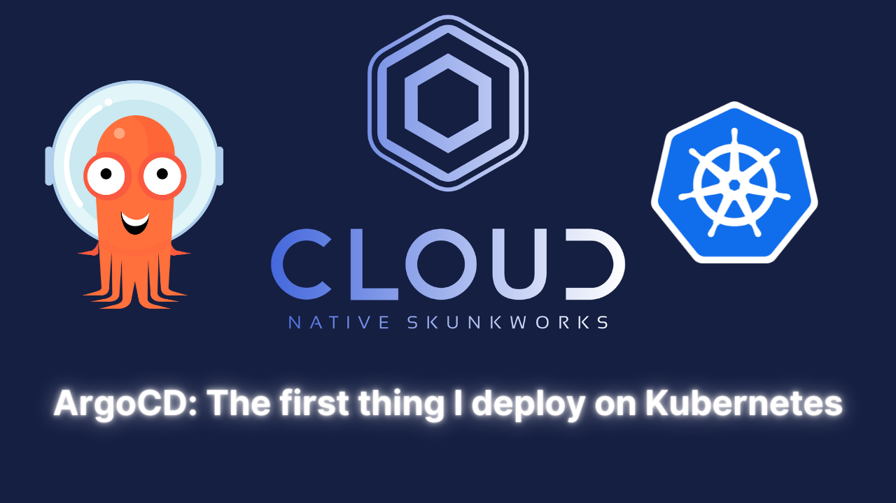
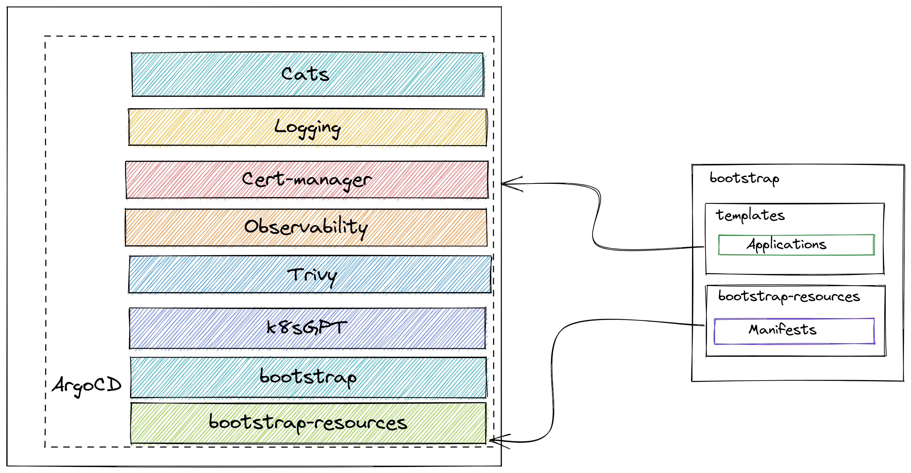

## gitops-cluster-bootstrap

This is an app-of-apps style start up repository for ArgoCD.

The goal is to setup a production like set of workloads ( observability, security and example applications ).

_See the video here_

<a href="https://youtu.be/GAu1INNeE7E">

</a>

## Workloads

Workloads are deployed through ArgoCD in an app-of-apps style deployment.
Configuration of the application is done via the `bootstrap` root app that has it's own configuration within `values.yaml`. This is propagated into the child apps.

When looking at the wider business context, we see how the applications in this repository can feed more broadly back into the business.

### bootstrap

This folder contains application templates. You can either add a helm chart or git repository as the source. You can copy an existing application or import some you've written before for argocd.


#### bootstrap-resources

This folder contains the resources that are used by the bootstrap application. Such things might be application specific resources like network policies, ingress settings or service accounts. The idea is that this folder is continuously and automatically synced with the cluster. **It helps to get around the problem of having to make a another gitOps repo just for settings of an app.**




### Default applications

| Application            | Link                                                    |
|------------------------|---------------------------------------------------------|
| Cats                   | https://github.com/AlexsJones/cats                      |
| Cert manager           | https://charts.jetstack.io                              |
| Komodor                | https://github.com/komodorio/helm-charts                |
| Observability CRDS     | https://github.com/prometheus-community/helm-charts.git |
| Local path provisioner | https://github.com/rancher/local-path-provisioner.git   |
| Logging                | https://grafana.github.io/helm-charts                   |
| Metallb                | https://metallb.github.io/metallb                       |
| Observability          | https://prometheus-community.github.io/helm-charts      |
| Nginx                  | https://helm.nginx.com/stable                           |
| Trivy                  | https://aquasecurity.github.io/helm-charts/             |


## Prerequisites

- Spin up a Kubernetes cluster on your favourite cloud provider or hardware

- Setup argocd

```
kubectl create namespace argocd
kubectl apply -n argocd -f https://raw.githubusercontent.com/argoproj/argo-cd/stable/manifests/install.yaml
```
- Save the Argocd password
```
kubectl -n argocd get secret argocd-initial-admin-secret -o jsonpath="{.data.password}" | base64 -d
```

- Add this repository as a bootstrap cluster
```
kubectl apply -f bootstrap.yaml
```


### Custom values

Check `values.yaml` and adjust as required

## Credits

Prometheus CRD's when used with ArgoCD apply can get big, so here is a hack to get arond the sync errors
Thanks to [this](https://blog.ediri.io/kube-prometheus-stack-and-argocd-23-how-to-remove-a-workaround) guide.

### Software tooling BOM

- kubectl
- kubectx
- k9s
- jq
- kustomize
- helm
- sshuttle
